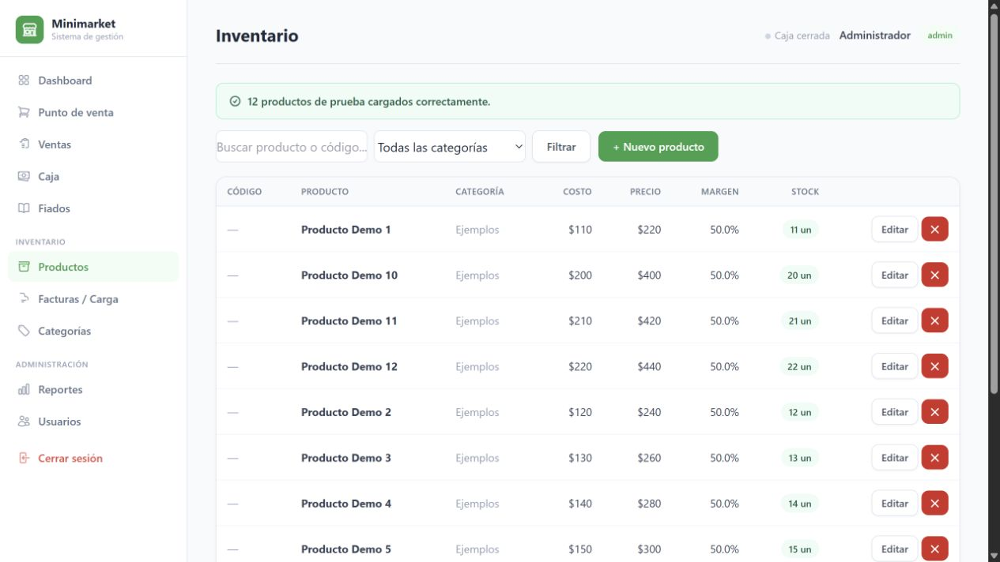

# Minimarket Demo

Aplicación de muestra para punto de venta, inventario, caja, fiados, reportes y revisión de facturas. Construida con Flask, SQLAlchemy y plantillas HTML.



## Alcance

Edición pública separada de cualquier negocio real. El catálogo incluido se generó para esta demo: nombres, costos, precios y stock son ficticios. No incluye bases de datos, facturas, clientes, proveedores, información tributaria ni historiales operativos.

## Ejecutar localmente

Requiere Python 3.12 o superior.

```bash
python -m venv .venv
# Windows: .venv\Scripts\activate
# macOS/Linux: source .venv/bin/activate
pip install -r requirements.txt
python app.py
```

Abre http://localhost:5000. Usuarios de muestra: `admin` y `vendedor`; contraseña local de ambos: `demo-local-only`. Son credenciales ficticias y exclusivas de esta edición. Puedes reemplazarlas mediante `DEMO_ADMIN_PASSWORD` y `DEMO_SELLER_PASSWORD` antes de crear la base de muestra.

En Inventario → carga de prueba puedes generar los 12 productos ficticios. Las ventas, fiados y documentos que ingreses permanecen en tu base local; no se incluyen en el repositorio.

## Funciones

- POS con carrito y métodos de pago; inventario con margen y alerta de stock.
- Caja y arqueo, clientes con deuda y abonos, reportes por fecha.
- Administrador y vendedor con permisos distintos.
- Parser de DTE XML o PDF con revisión previa a la carga.

## Límites

La aplicación es un prototipo local. Las claves de sesión se generan en ejecución si no defines `SECRET_KEY`. Esta demo no debe exponerse a Internet con sus usuarios de muestra. Aún requiere endurecimiento de formularios, revisión de permisos y aritmética monetaria antes de un uso productivo.

## Autoría

Proyecto de Luka con desarrollo asistido por IA. Se publica con historial nuevo y fixtures sintéticos; el repositorio operativo se conserva por separado y privado.
